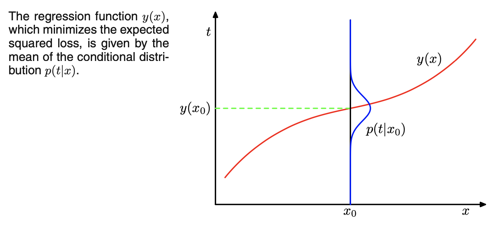

# PRML (CH1.3-1.6)

1월 11일 월요일 발표 (장한솔)

목차
1.3 모델 선택
1.4 차원의 저주
1.5 결정이론
1.6 정보이론

---

# 1.3 모델 선택

### 모델을 선택할 때, 훈련 시의 좋은 성능을 보이는 모델을 좋은 모델이라고 할 수 있을까?

- 최고의 모델은 ?
    - 과소적합하지도 않고,
    - 과대적합하지도 않는 모델

**과적합 문제**를 해결하기 위해서는
1) 데이터가 충분할 경우 : validation set → test set
2) 데이터가 충분하지 않을 경우(대부분) : validation set size 작아진다! (또 다른 문제점)

**교차검증법(cross validation)**
단점 : 여러가지 매개변수가 있을 경우, 기하급수적인 수의 훈련을 진행해야할 수 있다. 

**AIC(Akaike information criterion)**
복잡한 모델에서 과적합이 일어나지 않도록 패널티 항을 추가하는 방식
여러 통계 모델의 성능을 서로 비교할 수 있다. 다만, 절대적인 성능을 알려주기 보다는 최고의 모델을 고르는데에 사용된다. 
모델 선택 방법이자, 변수 선택 방법이라고 할 수 있다. 
(1) 모형적합도(likelihood)와 (2) 파라미터의 갯수를 이용한다. 

- likelihood는 최대화하는 동시에, 변수 갯수는 가장 적은 최적의 모델을 선택하고 싶다.
    - 위 수식에서는 값이 가장 큰 모델을 선택
    - 관측 데이터 집합 $$D$$, 매개변수 벡터 $w$ → 잘 피팅된 로그가능도 $p(D|w_{ML})$
    - 수정가능한 매개변수 $M$
- 예시: 경제적 지위에 기여하는 변수를 교육 수준, 건강 지표, 가족 구성원의 수, 부모의 경제적 지위 등등으로 두어서 측정한다
    - 가지고 있는 데이터가 100개라고 했을 때(가정), 변수가 100개인 경우
    - 회귀모델을 생각해본다면
        - 변수가 3개인 경우 $X_1, X_2, X_3, X_1 \& X_2, X_1 \& X_3, X_2 \& X_3, X_1 \& X_2 \& X_3$ 총 일곱 가지의 모델 비교가 필요하다.
        - 이런 관점에서 변수가 많아질 경우(모델에 사용되는 매개변수가 늘어날수록) 비교할 모델의 수가 기하급수적으로 늘어난다.

# 1.4 차원의 저주

### 큰 차원을 가지는 데이터?

- 고해상도 사진 데이터
    - MNIST 데이터도 28*28 = 784 (차원!) : 각 픽셀이 특정 변수가 된다.
- 구체적인 건강상태를 확인하는 문제
    - 키와 몸무게 데이터
    - 혈압, 체성분 지수, 나이 데이터 추가

### 고차원 공간의 입력변수를 다루게 되면, 문제가 생긴다!

차원에 따라서 데이터의 밀집도가 달라진다.

- 예시 : 15명의 데이터가 수집된 경우
    - 1차원에서는 15/5 = 300% 의 공간을 채울 수 있다.
    - 2차원에서는 15/25 = 60% 의 공간을 채울 수 있다.
    - 3차원에서는 15/125 = 12% 의 공간을 채운다.
- 변수가 늘어나면, 데이터 공간을 채우는 비율이 줄어든다!
- 충분히 공간을 표현할 만큼 데이터를 수집하지않고, 이 공간을 표현할 경우 과적합 발생 가능성이 커진다.

    

**차원의 저주 해결법**
1) 훈련 샘플의 밀도가 높아지도록 훈련 데이터의 크기를 키운다.
2) 차원을 축소한다.

두 가지 차원 축소 방법

2-1) Feature selection : 주요하게 영향을 미치는 변수를 고르고, 나머지를 버리는 방법

변수 간 중첩, 어떤 변수가 타겟에 영향을 크게주는 중요한 변수인지를 분석을 통해서 찾는다. (주로 사용하는 방법 : 상관분석)

2-2) Feature extraction : 변수 추출

모든 변수를 조합하여 데이터를 잘 표현할 수 있는 중요 성분을 가진 새로운 변수를 추출한다. (예시 방법: 주성분분석 (PCA, Principal Component Analysis)

# 1.5 결정이론

불확실성이 존재하는 상황에서 의사결정하기.

통계적으로 불확실한 가운데, 최적의 결정을 내리는 방법론

- 환자가 암에 걸렸는지, 아닌지를 판단하는 문제 (의사결정에서 확률 이용하기)

    

    - 입력(이미지)벡터 $x$, 타겟 $t$
        - 환자에게 암이 있음. $C_1 : t=0$
        - 환자에게 암이 없음. $C_2 : t=1$

## 1.5.1 오분류 비율의 최소화

목표 : 잘못된 분류의 숫자를 줄이자!

→ 실수가 발생할 확률을 줄여야한다. 

- $R_1$ 공간에서 ($C_1$으로 분류되어야하는데) $C_2$ 로 분류되는 확률
암이 있는데, 암이 없는 것으로 분류됌.
- $R_2$ 공간에서 ($C_2$으로 분류되어야하는데) $C_1$ 로 분류되는 확률
암이 없는데, 암이 있는 것으로 분류됌.

- $\hat x$ 기준으로 살펴보기
    - $R_1$ 공간에서 ($C_1$으로 분류되어야하는데) $C_2$ 로 분류되는 확률
    (위의 수식에서 왼쪽 항) 초록색과 빨강색 확률의 합
    - $R_2$ 공간에서 ($C_2$으로 분류되어야하는데) $C_1$ 로 분류되는 확률 
    (위의 수식에서 오른쪽 항) 파랑색에 해당하는 확률값
- 최적 지점 $x_0$
    - $R_1$ 공간에서 ($C_1$으로 분류되어야하는데) $C_2$ 로 분류되는 확률
    점선 기준, 왼쪽 초록색 부분에 해당하는 확률값
    - $R_2$ 공간에서 ($C_2$으로 분류되어야하는데) $C_1$ 로 분류되는 확률
    파랑색에 해당하는 확률값

→ 올바로 분류될 확률을 극대화한다.

- $R_1$ 공간에서 ($C_1$으로 분류되어야하고, 실제로) $C_1$ 로 분류되는 확률
- $R_2$ 공간에서 ($C_2$으로 분류되어야하고, 실제로) $C_2$ 로 분류되는 확률

위의 그림 예시에서 살펴보기

- $\hat x$ 기준 : 선 안으로 들어오는 부분 중, 하얀색 부분의 확률 합
- $x_0$ 기준 : 선 안으로 들어오는 부분 중, 하얀색 부분과 빨강색 부분의 합

## 1.5.2 기대 손실의 최소화

- 위의 예시처럼 두 가지 경우의 오분류를 고려하는 것이 과연 최선의 방법일까?
    - 암이 없는데 있다고 분류할 경우 : 재검
    - 암이 있는데 없다고 분류할 경우 : 사망 가능성이 커진다!!!

    암이 있는데 없다고 분류하는 경우와 암이 없는데 있다고 분류하는 두 가지 경우의 중요도를 동일하게 보면 안된다!

손실함수를 설정, 손실함수의 해를 최소화하는 방향으로 모델을 학습한다.

- 제대로 맞출 경우에 대해서는 가중치를 줄 필요가 없음 : 0으로 설정
- $1 \le k, j \le 2$, 두 값이 다를 때가 손실함수에 포함된다.

    

    위에서 본 함수 : 암이 있는데 없는 것으로 분류될 확률 + 암이 없는데 있는 것으로 분류될 확률

    - 왼쪽 항에 1000을 곱해주는 식이 만들어진다. (손실함수)

    

    - $p(x, C_k) = p(C_k|x)p(x)$, $p(x)$는 모든 항에서 동일하다.

## 1.5.3 거부 옵션

두 가지 경우로 분류를 해야할 때(암이 있다 or 암이 없다), 두 클래스 분류될 확률이 너무나 비슷한 값을 가질 때!

임계값을 설정 → 결정을 내리기 힘든 지역에서 결정을 피하기 전략

- 다소 불확실한 암 검사 이미지에 대해서는 사람이 직접 확인하여 결정하도록 한다.

- $\theta =1$, 모든 결정을 하지 않는다!
- $0 \le \theta \le 1$
- 이 그림에서 $\theta$ 는 어디에 잡아야 가장 합리적일까?

## 1.5.4 추론과 결정

결정 문제를 푸는 세 가지 접근법

1) 분포를 모델링 (generative model) 

$p(x|C_k)$를 알아내기! ($p(x, C_k)$를 계산한다)

만들어진 분포로부터 표본을 추출, 입력 공간에 합성 데이터 포인트들을 생성한다.

- 상당히 큰 훈련 집합이 필요하다. → 데이터 요구량이 크다.
- 새로운 데이터 포인트를 발견할 수 있다.
- 각 클래스 별 사후확률을 구한다. (분모는 아래와 같은 수식을 통해 구한다.)

2) 사후 확률을 직접 모델링 (discriminative model)

- 결정을 내리는 것만이 목표일 경우

3) 판별함수를 찾기 $f(x)$

- 확률을 다루지 않는 방식으로, 사후 확률을 추정하지 않는다.
- 아래 그림에서 녹색 선을 바로 찾는다(?)

사후확률을 구하는 (2) 방식이 의미있는 이유

- 위험의 최소화 : 손실 행렬의 값이 변화할 때 적용가능하다.
- 거부 옵션 : 초록색 라인을 통해서 분류 선택 유보 할 수 있는 영역을 만들 수 있다.
- 얻어진 사후 확률을 다시 사전 확률로 가정 → 새로운 데이터에 적용할 수 있다.
- 모델들의 결합
    - 엑스레이 이미지, 혈액 정보 → 암 여부 판단하는 문제 (두 데이터의 분포 독립 가정)

        사후확률 구하기

        

        

        

        - 클래스 별 사전 확률 필요

## 1.5.5 회귀에서 손실 함수

평균(기대) 손실

- 각각의 $x$ 포인트에 대해서, $t$ 추정값 $y(x)$ 만들어낸다.
- $t, y(x)$의 차이를 가늠하는 손실함수 : $L(t, y(x))$

- 회귀에서 일반적으로 사용하는 손실함수 $L(t, y(x)) = \{y(x)-t \}^2$ (MSE)

$E[L]$ 최소화하는 $y(x)$ 선택하기 

$y(x)$로 $E[L]$ 미분!

$\int\{y(x)-t\}p(x, t)dt = 0$

$\int{y(x)p(x, t)dt} - \int{tp(x, t)dt} = 0$

$y(x)\int p(x, t)dt - \int{tp(x, t)dt} = 0$

$y(x)p(x)- \int{tp(x, t)dt} = 0$

$y(x)p(x) =  \int{tp(x, t)dt}$

- $\frac{p(x, t)}{p(x)} = p(t|x)$

민코브스키 손실

- 제곱 손실 이외의 다른 것들도 활용 가능(더 복잡한 접근법을 사용해야하는 경우 활용 가능)

    

    

# 1.6 정보이론

### 정보량

정보량을 표현 → 놀라움의 정도

- 예시 : 미국 통계분석사이트인 '파이브서티에이트'는 2018 러시아 월드컵에서 한국이 독일에게 승리할 확률을 5%로 예측했고, 독일이 승리할 확률은 81%로, 비길 확률은 14%로 예측했다.
    - 독일이 한국을 이기는 경우 : $-log_20.81 = 0.304$
    - 한국이 이기는 경우 정보량 : $-log_20.05 = 4.3219$ → 가장 놀라운 사건
    - 두 팀이 비기는 경우 정보량 : $-log_20.14 = 2.8365$

### 엔트로피

정보량의 기댓값

- 위의 예시에서 엔트로피 구하기

    $0.81 \times -log_20.81 + 0.05 \times -log_20.05 + 0.14 \times -log_20.14 = 0.8595$

- 모든 확률이 33% 일 때의 엔트로피

    $0.33 \times -log_20.33 + 0.33 \times -log_20.33 + 0.33 \times -log_20.33 = 1.5835$

⇒ 결과가 예상되는 사건일수록 엔트로피가 작고, 결과를 예상하기 힘들수록 엔트로피가 크다.

- 왼쪽 분포가 오른쪽 분포에 비해서 엔트로피가 크다!
    - 왼쪽 분포는 분포 별 확률 차이가 오른쪽 그래프에 비해서 두드러진다.

### 크로스 엔트로피(상대 엔트로피)

실제 분포 $q$, 예측 분포 $p$ 일 때에 실제 분포에 가깝에 예측 분포를 만들고자 한다.

- 예:  가방에 0.8, 0.1, 0.1 의 비율로 빨강,녹색, 노랑 공이 들어가 있다. 하지만 직감에는 0.2, 0.2, 0.6의 비율로 들어가 있을 것 같다. 이 때, entropy 와 cross-entropy 는 아래와 같이 계산된다.
    - 엔트로피 : $0.8 \times -log_20.8 + 0.1 \times -log_20.1 + 0.1 \times -log_20.1 = 0.63$
    - 크로스 엔트로피 : $0.8 \times -log_20.2 + 0.1 \times -log_20.2 + 0.1 \times -log_20.6 = 1.50$

→ 예측 분포인 $p$ 가 $q$ 에 가깝도록 학습되면 좋겠다.

### KL divergence

두 확률분포의 차이를 계산하기 위해서 사용한다. 

$KL(p‖q)=H(p,q)−H(p)$

$H(p, q) = -\sum{p_i log_2q_i}$

 $= -\sum{p_i log_2q_i} -\sum{p_i log_2p_i} +\sum{p_i log_2p_i}$

 $= -\sum{p_i log_2q_i} + H(p) +\sum{p_i log_2p_i}$

$= H(p) +\sum{p_i log_2p_i} -\sum{p_i log_2q_i}$

$= H(p) +\sum{p_i log_2\frac{p_i}{q_i}}$ 

- $p$ 의 엔트로피에 $\sum{p_i log_2\frac{p_i}{q_i}}$  만큼이 더해진다
- $\sum{p_i log_2\frac{p_i}{q_i}}$  : $p, q$ 분포의 정보량 차이 !

- 크로스엔트로피를 최소화하는 것은 결론적으로 KL divergence 최소화와 같다.
    - $H(p)$ : 고정된 상수값

**KL divergence의 특성**

- $0 \le KL(p‖q)$

    '크로스엔트로피 - 엔트로피'

    크로스 엔트로피의 최솟값은 엔트로피 값과 같다. 
    $H(p, q)$는 $p$가 $q$일 때의 최솟값을 가진다. 

    $KL(p‖q)=−∫p(x)log\frac{q(x)}{p(x)}dx≥−log∫p(x)\frac{q(x)}{p(x)}dx$
    $−log∫p(x)\frac{q(x)}{p(x)}dx=−log∫q(x)dx=−log1=0$  

    $∴KL(p‖q)≥0$

- $KL(p‖q) \ne KL(q‖p)$

    비대칭적이다. 

    $KL(p‖q)=H(p,q)−H(p) = \sum{p_i log_2\frac{p_i}{q_i}}$ 

    $KL(q‖p) = H(q,p)−H(q) = \sum{q_i log_2\frac{q_i}{p_i}}$ 

    → 거리 개념이 아니다.